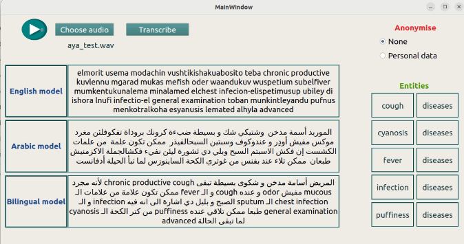

# Multilingual (Arabic/English) speech recognition system trained on Egyptian slang using Gaussian mixture model-hidden Markov model (HMM-GMM) with named-entity recognition (NER) for anonymization.

- Using the desktop-application you can choose the audio to transcribe it and generate the medical entities in the record.
- You can play the audio.
- By choosing the personal option in anonymization: The system is able to identify personal information in transcripted text and replace it with a dummy anonymized data which can be used for transmission to external electronic medical records systems (EMRs) or for research.

## GUI

* Transcribe the audio and generate the medical entities

* Anonymize the personal info in the transcribted text
